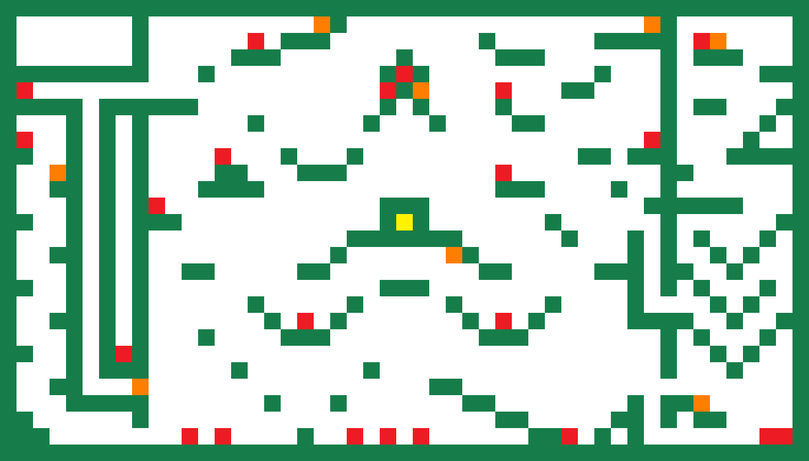
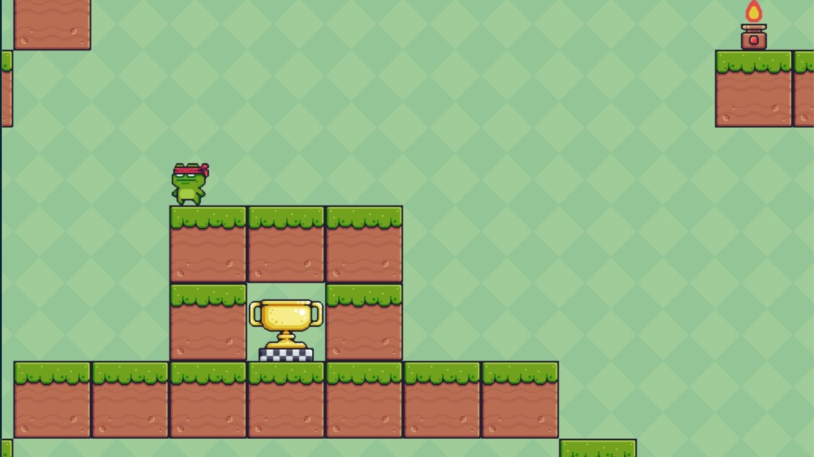
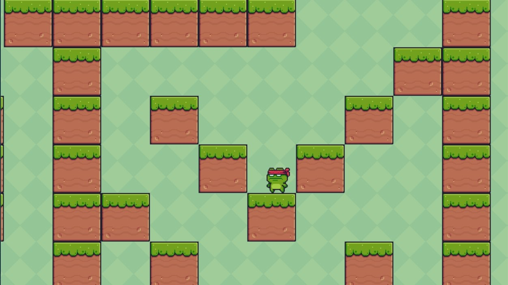
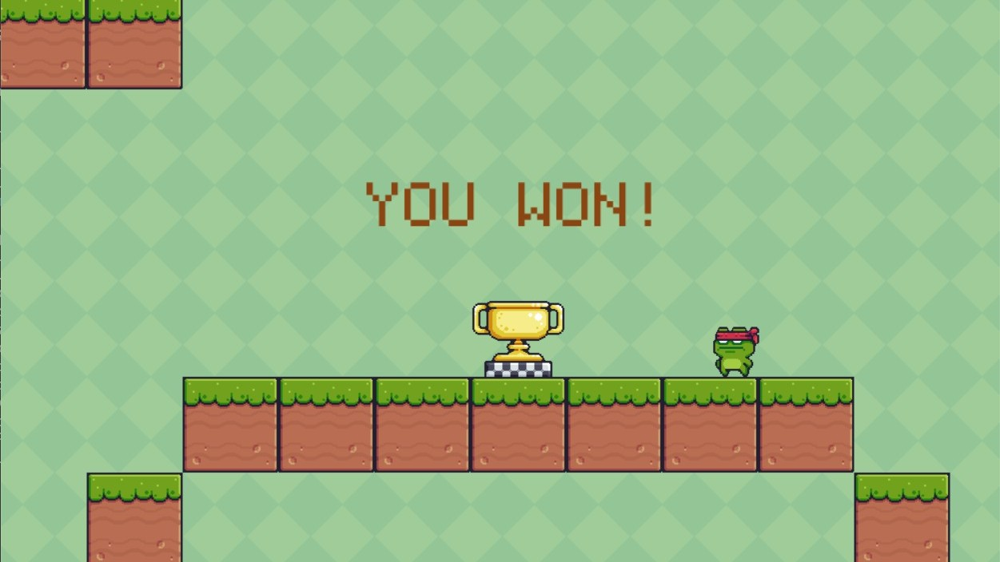

# Python Platformer Game 🕹️

A simple **Python-based platformer game** where the player navigates a grid, collects hidden fruits, and reaches the trophy to win.  
Built using **Python** and **Pygame**, this game is a fun way to practice programming logic, game design, and grid-based mechanics.

---

## Objective

The goal of the game is to:

1. **Collect all 8 hidden fruits** scattered across the grid.
2. **Reach the trophy** to win.

- Initially, the trophy is **protected by a barrier**.
- The barrier disappears **only after collecting all fruits**.
- Once the trophy is reached, a **"You Win!"** message appears.

---

## Grid Legend

The game uses a grid layout with different elements represented by colors:

| Color     | Element    | Description                                             |
| --------- | ---------- | ------------------------------------------------------- |
| 🟩 Green  | Walls      | Blocks player movement                                  |
| 🟥 Red    | Fire Traps | Touching a fire trap **prevents jumping for 2 seconds** |
| 🟧 Orange | Fruits     | Collect all 8 to unlock the trophy                      |
| 🟨 Yellow | Trophy     | Reach this after collecting all fruits to win           |

---

## Gameplay

Here’s a glimpse of the game in action:

1. Use **arrow keys** and **spacebar** to move your character.
2. Avoid fire traps.
3. Collect all 8 fruits.
4. After collecting all fruits, the barrier around the trophy disappears.
5. Move to the trophy to trigger the **"You Win!"** message.
